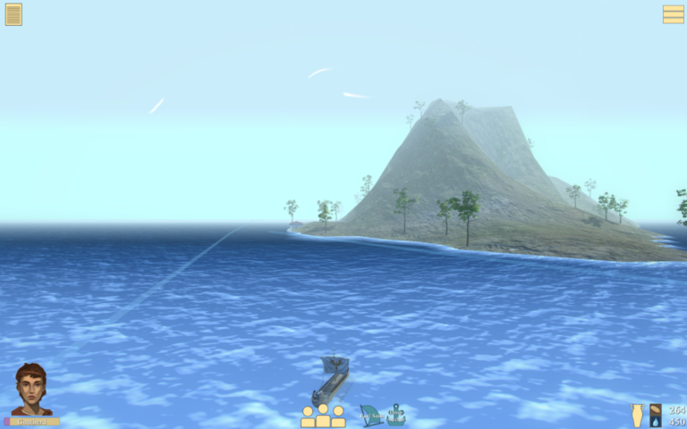

sailingwiththegods
===================

 [](https://app.codacy.com/manual/kddressel/sailingwiththegods?utm_source=github.com&utm_medium=referral&utm_content=kddressel/sailingwiththegods&utm_campaign=Badge_Grade_Dashboard)



This game is designed to:

* maximize immersion in the realities of sailing the ancient sea, closing the gap between our modern perspectives of sea travel and ancient realities
* generate data recorded from players’ behavioral patterns when making choices about how to move about the maritime networks
* integrate ancient voices from history and mythology with geospatial realities of economic resources, political trends and potential for gathering up to date knowledge

[Visit the website](https://scholarblogs.emory.edu/samothraciannetworks) for more information!

# Setup

This Build uses Unity 2018.3.8f1

While the main game code is open source, the game depends on a private repo for assets purchased from the Unity Asset Store. This should go in the ```Assets/_Proprietary``` folder.

# Documentation

* [Coding Conventions](docs/coding-convention.md)
* [UI System](docs/ui-system.md)
